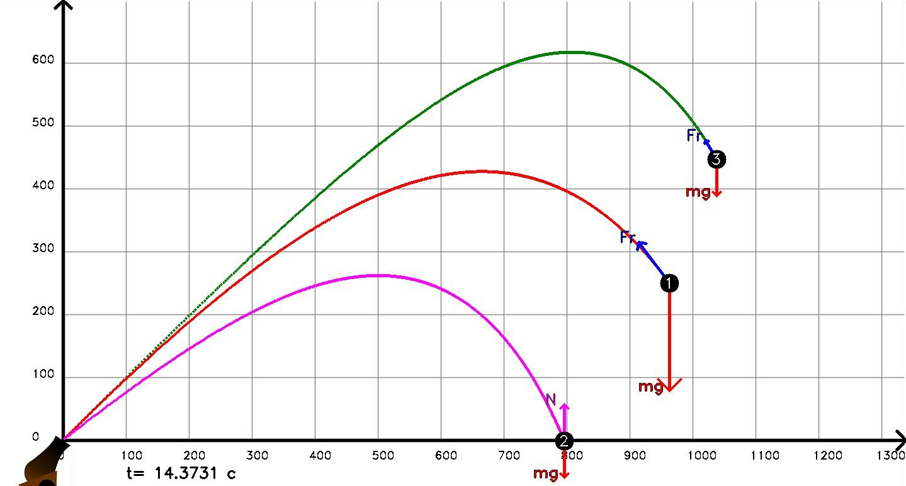

# Bullet flight simulator
Simulated real atmosphere characteristics during on bullet.

**Цель программы**

Цель программы -- расчёт дальности полёта снаряда известной формы и массы с заданными начальными параметрами. Расчёт производится численно.

**Особенности**

Параметры снаряда можно менять в главном файле программы. Одновременно может симулироваться много снарядов.
Возможно два режима работы - с визуализацией на OpenCV и без неё. Для изменения закоментите #define ENABLE_OPENCV.

**Расчёт сопротивления**

+ [Формула расчёта сопротивления](https://en.wikipedia.org/wiki/Drag_coefficient) применима на скорости меньше звуковой и расстояниях полёта не вносящих вклад в давление и слу тяготения.

  `F= c*p*v^2*s/2`
  
  c - безразмерный аэродинамический коэфициент (drag coefficient)(в случае шара примерно 0.3)
  
  р - плотность среды (для воздуха при температуре 20, равен  1.2041 кг/м^3)
  
  v - скорость объекта
  
  s - характерная площадь поперечного сечения (Area)

**Структура файлов**

Файлы разбиты по функционалу:

+ physics.h - Класс снаряда и обработчик физики
+ colors.h, display.h - Набор цветов, Класс окна и функции рисования и сведения слоёв
+ mainsource.cpp - вкл/выкл анимации, создание графического окна, настройка параметров снарядов

**Требования**
+ Для графики требуется OpenCV 4.0.0 (Инструкция по установке лежит внутри)
+ Windows 10

