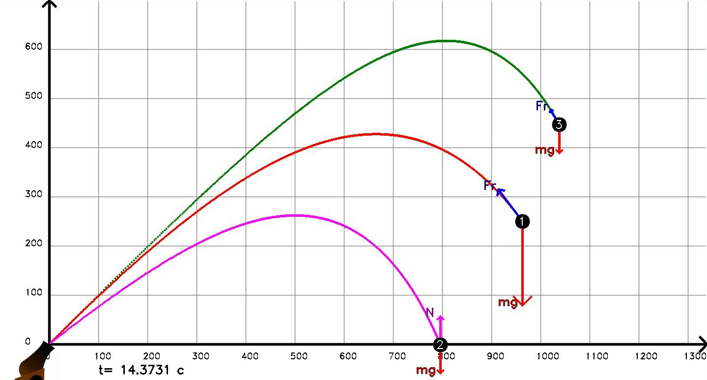

# Bullet flight simulator
Simulated real atmosphere characteristics during on bullet.

**Цель программы**

Цель программы -- расчёт дальности полёта снаряда известной формы и массы с заданными начальными параметрами. Расчёт производится численно.

**Расчёт сопротивления**

В программе представлены два варианта рачёта.

+ [Закон Стокса](https://ru.wikipedia.org/wiki/%D0%97%D0%B0%D0%BA%D0%BE%D0%BD_%D0%A1%D1%82%D0%BE%D0%BA%D1%81%D0%B0), закон, определяющий силу сопротивления F, 
  испытываемую твёрдым шаром при его медленном поступательном движении в неограниченной вязкой жидкости: 
  `F = 6 * pi * u * r * v`
   u - коэффициент вязкости жидкости (для воздуха при 27 градусах = 18.6 * 10^-6)
   r - радиус шара и v — его скорость. 	

  Эта формула выведена Дж. Г. Стоксом в 1851. С. з. справедлив лишь для малых чисел Рейнольдса Re <= 1. 
  Им пользуются в коллоидной химии, молекулярной физике и метеорологии. 
  По С. з. можно определить скорость осаждения мелких капель тумана, коллоидных частиц, частиц ила и других мелких частиц. 
  Предельную скорость Vпр падения шарика малых размеров в вязкой жидкости находят по этой формуле

+ И [более точная](https://ru.wikipedia.org/wiki/%D0%9B%D0%BE%D0%B1%D0%BE%D0%B2%D0%BE%D0%B5_%D1%81%D0%BE%D0%BF%D1%80%D0%BE%D1%82%D0%B8%D0%B2%D0%BB%D0%B5%D0%BD%D0%B8%D0%B5) на масштабах пушечных расстояний. Сила сопротивления направлена против скорости движения, её величина пропорциональна характерной площади S, плотности среды ρ и квадрату скорости V:

  `F= c*p*v^2*s/2`
  c - безразмерный аэродинамический коэфициент (в случае шара экспериментально примерно 0.3)
  р - плотность среды (для воздуха при температуре 20, равен  1.2041 кг/м^3)
  v - скорость объекта
  s - характерная площадь поперечного сечения (для шара это площадь поперечного сечения pi*r^2)

Изменять их можно в параметре объекта классна снаряда bullet.formula = false (для стокса) и true для более точной.

**Структура файлов**

Файлы разбиты по функционалу:

+ physics.h - физический обработчик
+ colors.h, display.h - функции отрисовки
+ assistfunction.h - для упрощения читаемости, набор снарядов
+ mainsource.cpp - вкл/выкл анимации, создание графического окна

**Требования**

+ Для графики требуется OpenCV 4.0.0
+ Windows 10

